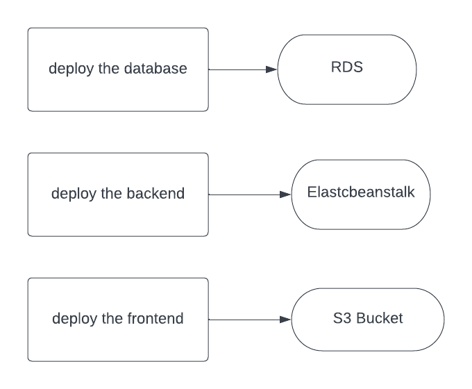

# Hosting a Full-Stack Application

### Dependencies

```
- Node v14.15.1 (LTS) or more recent. While older versions can work it is advisable to keep node to latest LTS version

- npm 6.14.8 (LTS) or more recent, Yarn can work but was not tested for this project

- AWS CLI v2, v1 can work but was not tested for this project

- A RDS database running Postgres.

- A S3 bucket for hosting uploaded pictures.

```

## Steps and tools for deploy fullstack application

##RDS

- First we need RDS inorder to create a hosted deployed database on aws.
- After we create db using rds we connect our app using sequelize

```
  const stringUrl: string = "postgres://${RDS_USERNAME}:${RDS_PASSWORD}@${rds_db_url}:${posgres_port}/postgres";
	Export sequelize(stringUrl);
```

## Elasticbeanstalk

- use elastic beanstalk first you create your IAM User
- init eb
- put the env variables in ./bin/deploy.sh refering to circleci env variables
- create environment
- deploy application
- check health of elasticbean and created s3 bucket

## S3 bucket

- create bucket
- build frontend application
- upload ./www folder to bucket and make the entrypage is index.html and error page also
- fix publicity settings of application and make it web hosting application
- check the url deployed

## License

[License](LICENSE.txt)

## screenshots:


