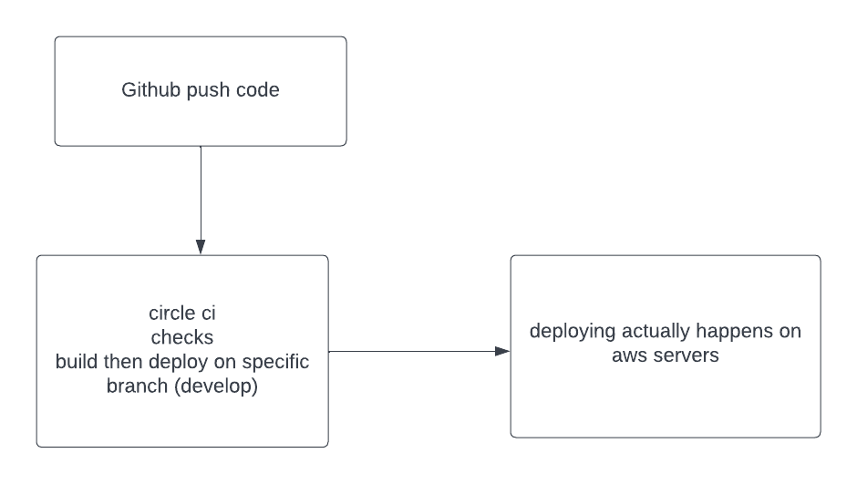
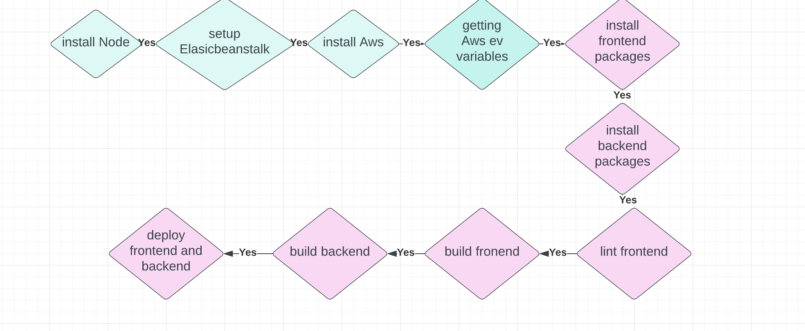

# Hosting a Full-Stack Application

### Pipeline Steps:

- install frontend dependencies
- install backend dependencies
- build frontend app
- build backend app
- lint frontend app
- deploy frontend app
- deploy backend app

## License

[License](LICENSE.txt)

## screenshots:

